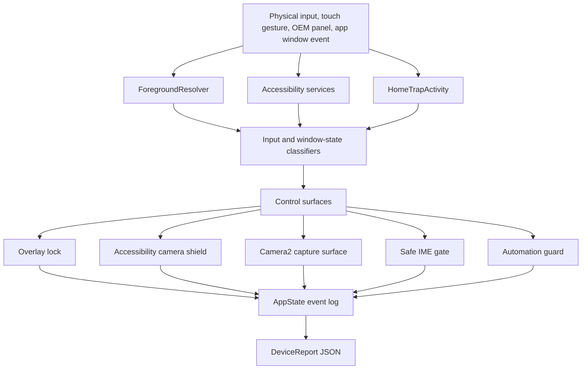

# Architecture

WatchGuard VP39 is structured as a single Android app with several runtime control surfaces. The design goal is not to hide firmware complexity; it is to make each layer observable enough to explain why a mitigation worked or failed.

## Runtime Layers

`ForegroundResolver` combines task, usage, and raw package signals to classify whether the visible screen is an app, launcher/menu, system navigation surface, or unknown state.

`GptAutomationAccessibilityService` is the main accessibility process. It observes trusted window-state transitions, filters relevant hardware-key events when Android exposes them, hosts the camera touch shield, and records OEM panel escapes.

`HomeTrapActivity` is a temporary launcher entrypoint. When the user selects WatchGuard as the default launcher, HOME-style hardware input can be represented as an Activity launch and classified by the app.

`TouchBlockerService`, `WatchCameraGestureGuardService`, and the accessibility shield use different overlay types because the firmware does not treat all overlay layers equally. The app records which layer is active and whether the OEM panel still escaped.

`WatchGuardCameraActivity` owns the controlled Camera2 experiment. It avoids relying on the native camera app for test behavior and records capture, shield, pause, restore, and panel-rebound state.

`TinyInputMethodService` and `SafeImeGateService` test keyboard behavior on a small screen where unsolicited IME openings can break the interaction model.

## State and Diagnostics

`AppState` centralizes counters, timestamps, diagnostic strings, and lifecycle transitions. That is intentional: the report needs to explain both the visible result and the app's internal belief at the time.

`DeviceReport` serializes that state into JSON so failures can be compared across builds and firmware interactions. The report is the main output of the lab.
